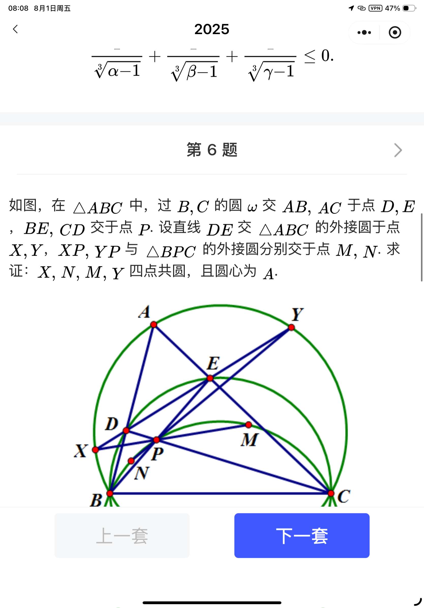

= 项目开发文档
作者: 张三
版本: 1.0
:toc:
:sectnums:

== 简介

AsciiDoc 是一种轻量级标记语言，语法比 Markdown 更丰富，适合写长文档、技术文档和书籍。

== 特性

* 支持自动目录（`:toc:`）
* 支持章节自动编号（`:sectnums:`）
* 内建表格、引用、脚注等
* 可直接导出为 HTML、PDF、DocBook 等

== 示例表格

|===
| 名称 | 类型 | 描述

| Markdown
| 轻量标记语言
| 简单易用，功能有限

| AsciiDoc
| 轻量标记语言
| 功能丰富，适合长文档
|===

== 嵌入代码

[source,python]
----
def greet(name):
    print(f"Hello, {name}!")

greet("AsciiDoc")
----

== 链接与图片

链接到 https://asciidoc.org[AsciiDoc 官网]

== 脚注示例

这里是一个脚注的例子。footnote:[这是脚注的内容。]
